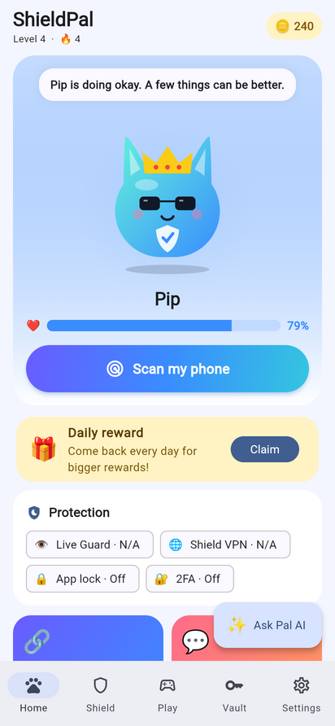
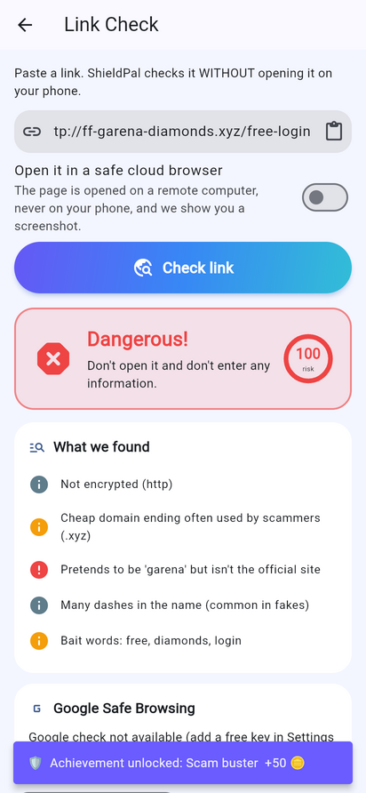
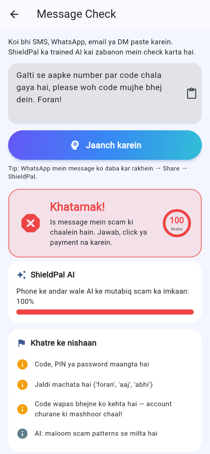
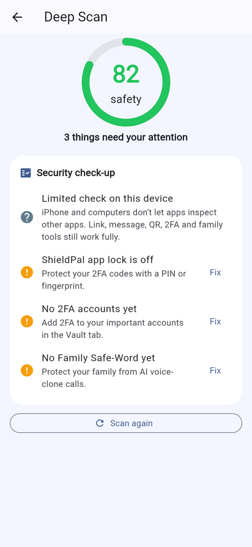

<p align="center"></p>

<h1 align="center">ShieldPal 🐾🛡️</h1>
<p align="center"><b>Your cute cyber guardian</b> — a security app with a pet that gets sick when your phone is in danger.</p>

<p align="center">
  <a href="https://usmanfarazz.github.io/shieldpal/"></a>
  <a href="https://usmanfarazz.github.io/shieldpal/privacy.html"></a>
</p>

<p align="center"><sub>The web demo runs the checks that work in a browser (links, messages, numbers, passwords, quiz, Pal AI). Live Guard, Deep Scan, Shield VPN and the notification features need the Android app.</sub></p>

<p align="center">




</p>

---

## Roman Urdu mein khulasa

ShieldPal ek **security app** hai jis mein ek pyaara pet "Pip" hai. Phone mehfooz ho to Pip khush rehta hai. Koi khatra aaye to Pip beemar ho jata hai, aur app **alarm, bolti warning aur notification** ke saath batata hai ke **kis app aur kis chat** mein khatarnak link ya scam aaya hai.

App banane wala: **Usman Faraz**. Flutter (Dart) aur native Android (Kotlin) se bana hai, aur Android, iPhone, Windows, Mac, Linux aur Web par chalta hai.

---

## ✨ Features

| | Feature | What it does | Platforms |
|---|---|---|---|
| 👁️ | **Live Guard** | Reads new notifications (WhatsApp, SMS, Telegram, Instagram, Gmail…) **on the phone**. When a scam message or dangerous link arrives it raises an alarm, speaks a warning and shows *which app and which chat* it came from — before you tap the link. Also warns when a risky app gets installed. | Android |
| 🛰️ | **Deep Scan** | Screen lock & lock strength (detects weak patterns), security patch age, Android version, developer options, USB debugging, root, apps with accessibility / device-admin / notification access, third-party keyboards, apps allowed to install apps, Google Play Protect status **and Play Protect's list of harmful apps**, other VPNs, open Wi-Fi. Every risky app gets a one-tap **Remove** button. | Android (limited on others) |
| 🔗 | **Link Check** | Offline analysis (look-alike brands like `ff-garena-…xyz`, typosquatting `g00gle`, punycode, raw IPs, `@` trick, risky TLDs, shorteners, bait words, APK downloads) + short-link expansion + **Google Safe Browsing** + **urlscan.io cloud sandbox** that opens the page far away and shows a screenshot. | All |
| 🚧 | **Safe Link Gate** | Set ShieldPal as the default browser: every tapped link is checked first, safe links open in your real browser instantly. | Android |
| 💬 | **Message Check** | Trained on-device AI (Naive Bayes, trains from `lib/core/scam_dataset.dart` on start-up) + multilingual rules (English, Roman Urdu, Urdu, Hindi, Arabic, Spanish, Portuguese, Indonesian, French, Turkish). Share any message to ShieldPal. | All |
| 📷 | **Safe QR** | Decodes QR codes before anything opens: phishing URLs, open Wi-Fi, payment QRs (UPI/EMV), crypto addresses, premium SMS, 2FA setup, family invites. | Android, iOS, macOS, Web |
| 📞 | **Number Check** | Country, number type (mobile / premium / VoIP…), original network (PK prefixes), wangiri & premium warnings, mark-as-scam. *Owner names and live location are private — no honest app can show them.* | All |
| 🌐 | **Shield VPN** | On-device DNS filter (no server): blocks known malware/phishing domains in every app via Cloudflare 1.1.1.2 + ShieldPal rules. Doesn't hide your IP. | Android |
| 🔐 | **2FA Vault** | Built-in authenticator (RFC 6238 TOTP, tested against the RFC vectors), add by QR or key, encrypted storage. | All |
| 👨‍👩‍👧 | **Family Safe-Word** | Rotating 3-emoji code shared by QR — stops AI voice-clone "send money" calls. | All |
| 🔑 | **Password Check** | Strength + crack time + **Have I Been Pwned** leak check (k-anonymity: only 5 hash chars leave the phone) + generator. | All |
| 🎮 | **Scam or Safe?** | Swipe game with a timer, combos, coins. | All |
| 🐱 | **Pet & rewards** | Mood from your real security score, daily streaks, coins, 20 outfits/skins, 10 achievements. | All |
| ✨ | **Pal AI** | Chat assistant. Offline knowledge base in every language; with a Claude API key it uses **Claude** and answers in your language. | All |
| 🔒 | **App lock** | PIN + fingerprint/face. | All |
| 🌍 | **14 languages** | English, اردو, Roman Urdu, हिन्दी, العربية, বাংলা, Español, Français, Português, Bahasa Indonesia, Türkçe, Русский, Deutsch, 中文 (RTL supported). | All |

---

## 🚀 Android Studio mein kaise chalayein (Step by step)

1. **Flutter install karein:** https://docs.flutter.dev/get-started/install
2. **Android Studio** install karein, aur us mein **Flutter** aur **Dart** plugins daalein (Settings → Plugins).
3. Is project ka folder unzip karein, phir Android Studio mein **File → Open → `shieldpal` folder** kholein.
4. Terminal mein yeh chalayein:
   ```bash
   flutter pub get
   flutter doctor        # check karein sab ✓ ho
   ```
5. Phone ko USB se lagayein (Developer options → USB debugging on), ya emulator chalayein.
6. Upar ▶️ **Run** dabayein, ya terminal se:
   ```bash
   flutter run
   ```
7. APK banane ke liye:
   ```bash
   flutter build apk --release
   # file: build/app/outputs/flutter-apk/app-release.apk
   ```

### Phone par pehli dafa
- **Live Guard:** app mein Shield → Protection → Live Guard → *Turn on* → list mein **ShieldPal** ko allow karein.
- **Notifications:** Android 13+ par "Allow notifications" ko haan karein.
- **Shield VPN:** Protection → Shield VPN → *Turn on* → VPN request ko OK karein.
- **Safe Link Gate:** Protection → Safe Link Gate → Default apps → Browser → ShieldPal.

### Doosre platforms
```bash
flutter run -d chrome      # Web
flutter run -d windows     # Windows laptop (Windows par chalayein)
flutter run -d macos       # Mac (Mac par chalayein)
flutter build ios          # iPhone (Mac + Xcode chahiye)
```

---

## 🔑 Optional API keys (Settings → Online services & AI)

App bina kisi key ke bhi chalta hai. Keys daalne se yeh extra features khul jaate hain:

| Key | Kahan se milegi | Kya karti hai |
|---|---|---|
| **Claude (Anthropic)** | https://console.anthropic.com | Pal AI ko samajhdar banati hai (model `claude-opus-5-5`, `fallbacks: "default"`) |
| **Google Safe Browsing** | Google Cloud Console → enable *Safe Browsing API* → Credentials | Links ko Google ki khatarnak list se milati hai |
| **urlscan.io** | https://urlscan.io/user/signup | Link ko cloud browser mein khol kar screenshot deti hai |

> ⚠️ **Play Store se pehle:** keys user ke phone par encrypted rehti hain, jo personal use ke liye theek hai. Agar aap app public karte hain to apni keys app ke andar mat daalein. Ek chhota backend (jaise Cloudflare Worker) bana kar keys wahan rakhein. Google Safe Browsing Lookup API sirf non-commercial use ke liye hai; commercial app ke liye **Google Web Risk API** use karein.

---

## 📦 Play Store checklist

- [ ] Apni **upload key** banayein aur `android/app/build.gradle.kts` mein release `signingConfig` set karein ([guide](https://docs.flutter.dev/deployment/android#sign-the-app)).
- [ ] **QUERY_ALL_PACKAGES** declaration form bharein. Wajah: "Security app that scans installed apps for malware/spyware".
- [ ] **Notification listener** ke liye prominent disclosure aur privacy policy (`Settings → Privacy` ka text use karein). Aapki privacy policy page `usmanfarazz.github.io/kryvo/privacy.html` jaisi jagah host ho sakti hai.
- [ ] **VpnService** declaration: "On-device DNS filter that blocks malicious domains; no traffic leaves to our servers".
- [ ] **REQUEST_DELETE_PACKAGES**: "Lets users remove apps flagged as dangerous".
- [ ] Data safety form: koi data collect nahi hota. Agar user ne keys di hon to links Google/urlscan ko aur chat Anthropic ko jaati hai.

---

## 🧱 Project structure

```
lib/
  core/            # all security logic (pure Dart, unit-tested)
    url_analyzer.dart     link phishing heuristics
    scam_engine.dart      on-device Naive Bayes + multilingual rules
    scam_dataset.dart     training data (add more lines to make it smarter)
    link_scanner.dart     short-link expand, Safe Browsing, urlscan sandbox
    qr_analyzer.dart      quishing protection
    phone_lookup.dart     number info & warnings
    password_checker.dart strength + HIBP k-anonymity
    totp.dart             RFC 6238 authenticator
    family_code.dart      rotating emoji safe-word
    assistant.dart        Pal AI (offline KB + Claude)
    device_bridge.dart    Flutter ⇄ Android channel
  screens/         # UI
  widgets/pet_view.dart   the pet, drawn & animated in code (also renders the app icon)
  l10n/            # 14 languages × 558 strings
  state/app_state.dart
android/app/src/main/kotlin/app/shieldpal/shieldpal/
  ShieldNotificationListener.kt  Live Guard
  DeviceAuditor.kt               Deep Scan
  ShieldVpnService.kt            Shield VPN (DNS filter)
  ScamHeuristics.kt              Kotlin twin of the scam rules (works when app is closed)
  Alerts.kt                      alarm + voice + notification
  MainActivity.kt                method channel, share & link handling
tool/icon_gen_test.dart          regenerates the app icon from the pet painter
test/                            unit + widget tests (all 14 languages)
```

Tests chalayein:
```bash
flutter analyze
flutter test
```

---

## 🙏 Seedhi baat: app kya nahi kar sakta

- **100% hacking detection** koi app nahi de sakta, Norton ya Google bhi nahi. Bahut advanced spyware (jaise Pegasus) aam apps se chhupa rehta hai. ShieldPal aam khatre pakadta hai: scam links, jasoos apps, kamzor settings aur khatarnak websites.
- **"Virus delete"**: Android kisi app ko chupke se doosri app delete nahi karne deta. ShieldPal khatarnak app dhoondta hai aur ek tap mein "Remove" ka option deta hai, aur aap confirm karte hain.
- **Number ka maalik ya location**: yeh private hai. Sirf police aur mobile company qanooni taur par trace kar sakti hai.
- **Laptop hacking**: phone app laptop ko scan nahi kar sakta. ShieldPal ka desktop version link, message, QR, 2FA aur password tools deta hai.
- **iPhone par** Live Guard, Deep Scan aur VPN nahi chalte, kyunki Apple apps ko doosri apps ki notifications parhne nahi deta.
- **Shield VPN** aapka IP nahi chhupata. Yeh sirf khatarnak sites block karta hai. Agar phone par "Private DNS" strict mode on ho ya Chrome mein "Secure DNS" on ho, to woh is filter ko bypass kar sakte hain.

---

Made with 💙 by Usman Faraz · Built with Flutter


---

## Release / Google Play

See [store/play_listing.md](store/play_listing.md) (listing text + checklist) and
[store/data_safety_and_forms.md](store/data_safety_and_forms.md) (Data safety + permission declarations).
The privacy policy is generated by `node tool/gen_policy.js`.

Build for Play (uses android/upload-keystore.jks, keep it safe and never commit it):

```powershell
$env:ORG_GRADLE_PROJECT_play="true"
flutter build appbundle --release
```

Local test builds (`flutter build apk --release`) stay debug-signed so they update the app already on your phone.
