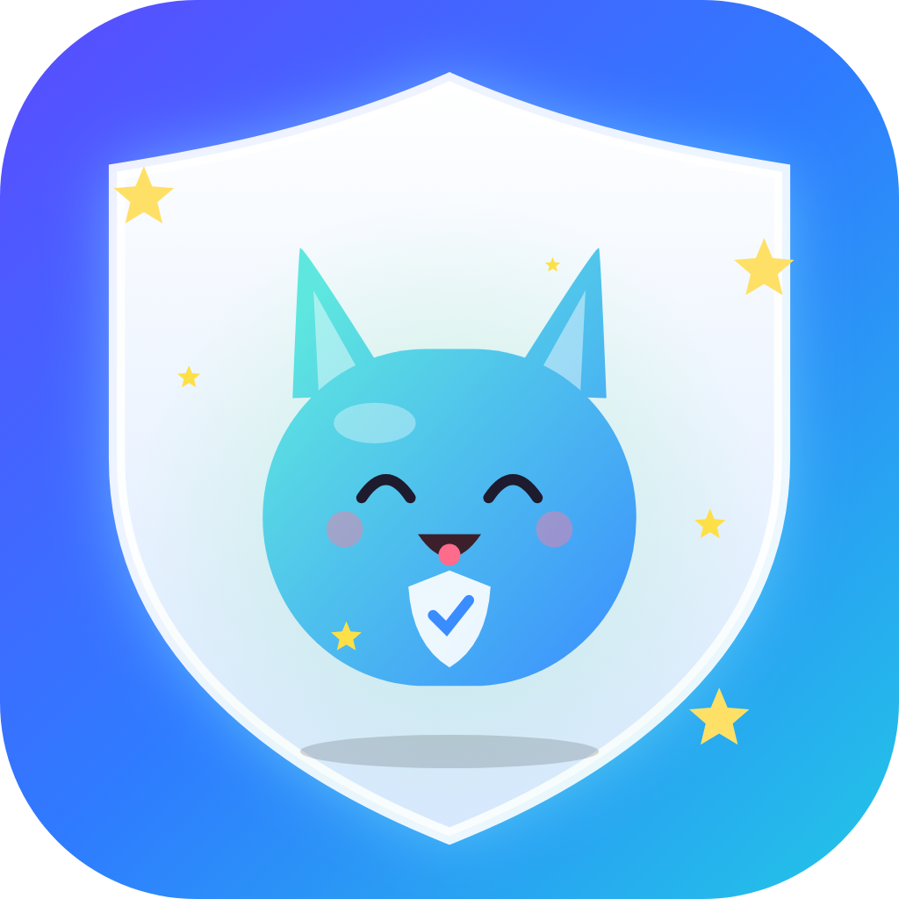
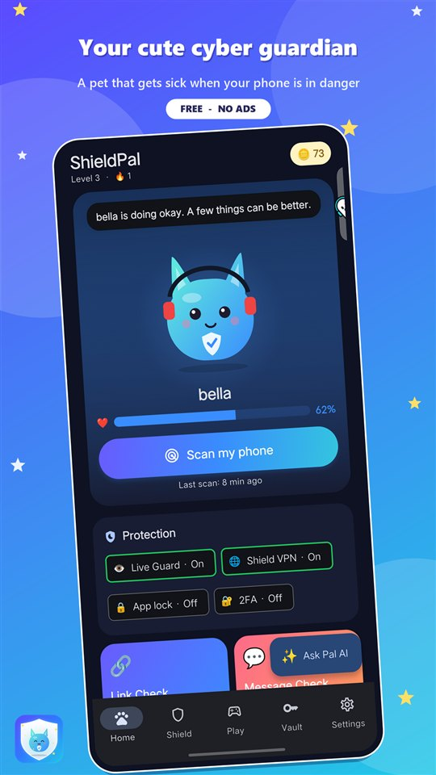
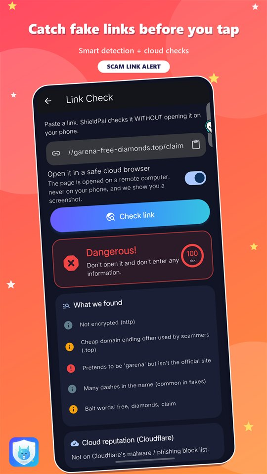
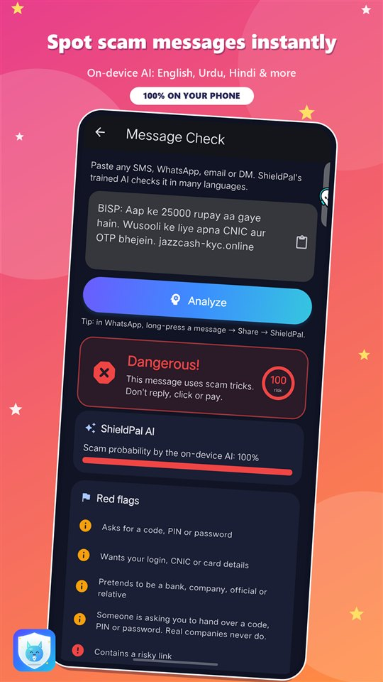
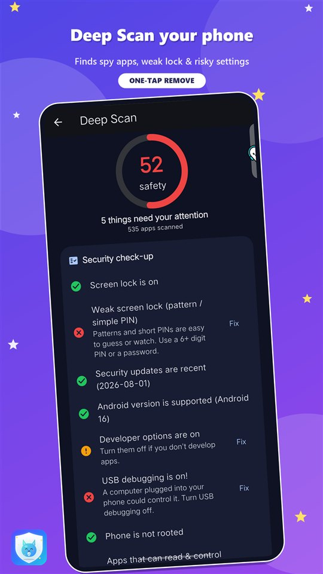

<p align="center"></p>

<h1 align="center">ShieldPal — Your cute cyber guardian</h1>

<p align="center">
A <b>scam, fake-link and QR checker</b> for Android with <b>Live Guard</b>, <b>Deep Scan</b>, a safety <b>VPN</b> and a
<b>friendly AI assistant</b> — plus a pet that gets sick when your phone is in danger.
</p>

<p align="center">
<b>🌐 Website & live demo:</b> <a href="https://usmanfarazz.github.io/shieldpal/">usmanfarazz.github.io/shieldpal</a> ·
<b>🔒 Privacy policy:</b> <a href="https://usmanfarazz.github.io/shieldpal/privacy.html">privacy.html</a>
</p>

<p align="center">




</p>

<p align="center">


</p>

---

## ✨ Try it

The [live demo](https://usmanfarazz.github.io/shieldpal/) runs the real app in your browser. Skip the intro, open the
**Shield** tab, then try **Link Check** with `http://garena-free-diamonds.top/claim` or **Message Check** with a scam SMS.

> 📱 Live Guard, Deep Scan, Shield VPN and the notification features need the Android app, which is coming soon to Google Play.

## Why it's safe

- **No account, no servers of our own.** Messages, notifications, your app list and Deep Scan results are checked on your
  phone and are never uploaded.
- **Optional online checks send only a small piece of data** (for example a website name to Cloudflare), and only when you
  use that feature. Every service is listed in Settings → *Online services & AI* with a **Test** button.
- **Secrets are encrypted** — 2FA seeds, API keys and the app-lock PIN live in Android Keystore-backed storage.
- **No ads, no analytics, no selling data.** *Delete all my data* erases everything in one tap.

> ⚠️ Shield VPN is a local safety VPN: it blocks dangerous websites and forwards everything else unchanged. It does **not**
> hide your IP address or change your country. The registered owner of a phone number is private, so Number Check never shows it.

## Features

| | |
|---|---|
| 👁️ **Live Guard** | Reads new notifications (WhatsApp, SMS, Telegram…) **on the phone** and raises an alarm — with a spoken warning — for scam links and messages, showing which app and chat they came from. |
| 🔗 **Link Check** | Look-alike brands, typosquatting, punycode, raw IPs, risky TLDs and bait words, plus short-link expansion and Cloudflare / Google Safe Browsing / urlscan.io checks. |
| 💬 **Message Check** | An on-device Naive Bayes model plus multilingual rules; it learns from your corrections. Share any message to ShieldPal. |
| 📷 **Safe QR** | Decodes a QR code before anything opens: phishing URLs, open Wi-Fi, payment QRs, crypto addresses, premium SMS. |
| 🛰️ **Deep Scan** | Screen-lock strength, patch age, developer options, USB debugging, root, accessibility / admin / notification-access apps, Play Protect — each with a one-tap fix or Remove. |
| 🌐 **Shield VPN** | A real on-device VPN that filters DNS (dangerous domains blocked), lets you pick the DNS server (Cloudflare, Google, Quad9, AdGuard, OpenDNS) and speeds lookups with a cache. |
| 🌍 **Remote VPN** | Optional: run your own WireGuard config so all traffic leaves from another server. |
| 📞 **Number Check** | Country, type, original network, wangiri / premium / VoIP warnings, and the name from your own contacts. |
| 🔑 **Passwords & 2FA** | Strength + Have I Been Pwned leak check (k-anonymity), a built-in authenticator and a Family Safe-Word against voice-clone scams. |
| ✨ **Pal AI** | Answers in the language you write in: offline knowledge base, optional free online AI, or your own Claude key. |
| 🐾 **Pet & game** | Choose a cat, bunny, bear, puppy or fox, change its voice, play the endless "Scam or Safe?" game and unlock achievements. |
| 🌍 **14 languages** | English, اردو, Roman Urdu, हिन्दी, العربية, বাংলা, Español, Français, Português, Bahasa Indonesia, Türkçe, Русский, Deutsch, 中文. |

## Tech

- **Flutter / Dart** UI and logic, with native **Kotlin** for Live Guard (`NotificationListenerService`), Shield VPN
  (`VpnService` with a small user-space TCP/UDP forwarder and DNS filter), Deep Scan, alerts and contacts lookup.
- Remote VPN uses the official [WireGuard tunnel library](https://github.com/WireGuard/wireguard-android).
- Storage via [`flutter_secure_storage`](https://pub.dev/packages/flutter_secure_storage) (Android Keystore) and
  `shared_preferences`; QR scanning with `mobile_scanner`; biometrics with `local_auth`.
- Tested by 30+ unit and widget tests, including accuracy tests for the scam and fake-link detectors.

```
lib/
  core/       scam engine, link / QR / number analysers, Pal AI, tips, quiz generator
  screens/    all app screens
  state/      AppState (single ChangeNotifier)
  l10n/       translations (14 languages)
android/      Kotlin: Live Guard, Shield VPN, Deep Scan, alerts, WireGuard bridge
site/         landing page + live demo (GitHub Pages)
store/        Google Play listing, data-safety answers, graphics, privacy policy
tool/         policy generator, icon generator, Pages deploy script
```

## Build

```bash
flutter pub get
flutter test
flutter run                      # run on a connected Android phone
flutter build apk --release      # local test build
```

Release bundles for Google Play are signed with an upload key read from `android/key.properties`, which is **not** in this
repository (see `.gitignore`):

```powershell
$env:ORG_GRADLE_PROJECT_play="true"; flutter build appbundle --release
```

Publish the website, live demo and privacy policy with `powershell -File tool\deploy_pages.ps1`.

## Security notes / roadmap

- Shield VPN covers IPv4 traffic; IPv6 is intentionally left unrouted so apps fall back to IPv4 instantly.
- The free online AI is a third-party service: your chat text is sent to it only if you agree on first use, and you can turn it off.
- iOS is not supported yet (Live Guard and the VPN filter are Android-specific).
- Found a security issue? Please see [SECURITY.md](SECURITY.md).

## Contact

Made by **Usman Faraz** · Faraz Labs —
[Email](mailto:usmanfaraz1818@gmail.com) · [LinkedIn](https://www.linkedin.com/in/usman-farazz)

© 2026 Usman Faraz. All rights reserved.
